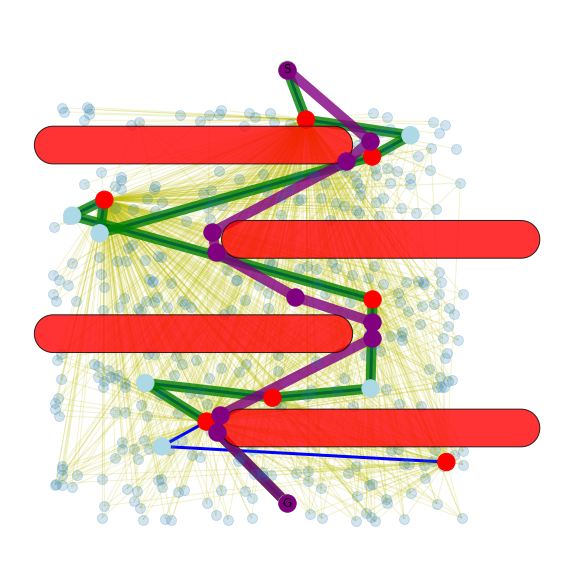
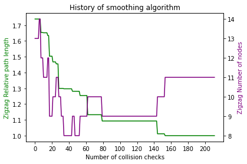

# Projektaufgabe 8: Glätten des Ergebnispfades nach Latombe

- Aufgabenstellung: siehe `Aufgabe_8.pdf`
- Präsentation siehe: `Präsentation.ppt`
- Smoothing Algorithmus: siehe `IPSmoothing.py`
- Ergebnisdiskussion: hier im `README.md`
- Lösungen zu Aufgabe 2: hier im `README.md`

## How to run:

Starte die Datei `IP-X-0-Automated_PlanerTest.ipynb`

Der Smoothing Algorithmus wird dort importiert, ebenso die Planer. (Achtung: teilweise wurden Bugs in den Planern korrigiert, damit alle Benchmarks durchlaufen, es sollten also die Dateien im Projekt verwendet werden)

Der Smoothing Algorithmus arbeitet mit `resultList` der vorherigen Schritte.

```python
from IPSmoothing import IPSmoothing
k = 3 # Parameter for smoothing
eps = 0.5 # Cancel threshold for DelTree
variance_steps = 20 # Window for rolling variance
min_variance = 0.01 # Minimum variance as cancel threshold

IPSmoothing.statistics = []

for result in resultList:

    smoother = IPSmoothing(result, plannerFactory)

    smoothed_graph = smoother.smooth_solution(k, eps, variance_steps, min_variance)

    if smoothed_graph is not None:
        smoother.visualize_path(plannerFactory, smoothed_graph)
        smoother.draw_history()

# Plot graph and statistics for every solution
# IPSmoothing.draw_statistics(IPTestSuite.benchList) #[0:24]
# IPSmoothing.draw_history_per_benchmark(IPTestSuite.benchList, num_coll_checks = 200, combine_all = False)

IPSmoothing.draw_history_per_benchmark(IPTestSuite.benchList, num_coll_checks = 200, combine_all = True)
IPSmoothing.draw_statistics_all_combined()
```

## Ergebnisdiskussion

### Single benchmark and single algorithm





### Smoothing statistics per benchmark and algorithm


### Smoothing history per benchmark (mean and error of algorithms)


### Smoothing history for all benchmarks and algorithms


### Smoothing statistics per algorithm (mean and error of benchmarks)


## Lösungen zu Aufgabe 2
### Kann der Lösungspfad mit einem Industrieroboter abgefahren werden?

### Was bremst die Abfahrgeschwindigkeit noch aus?

### Wie könnte man weiterhin die Abfahrgeschwindigkeit erhöhen?
