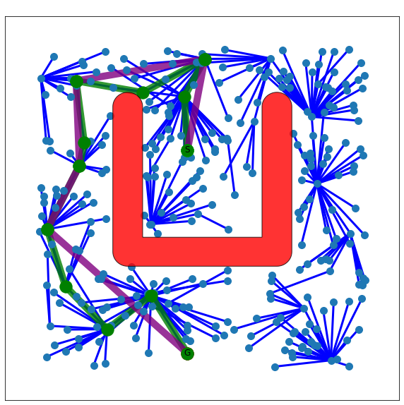
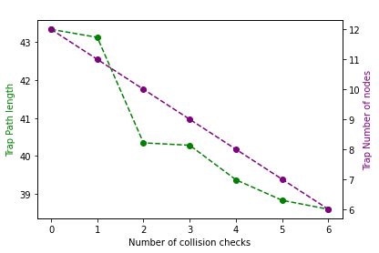
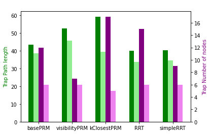

# Projektaufgabe 8: Glätten des Ergebnispfades nach Latombe

Neue Klasse `IPSmoothing` mit Algortihmus und Helferfunktionen

## How to run:

Anwendung im python notebook mit `resultList` der vorherigen Schritte:

```
from IPSmoothing import IPSmoothing
k = 3 # Parameter for smoothing
eps = 1 # Cancel threshold for DelTree

for result in resultList:

    smoother = IPSmoothing(result)

    smoothed_graph = smoother.smooth_solution(k, eps)

    if smoothed_graph is not None:
        smoother.visualize_path(plannerFactory, smoothed_graph)
        smoother.draw_statistics()

IPSmoothing.draw_comparison(IPTestSuite.benchList[0:3])
```

## Visualization output





## ToDo:

- [ ] Lazy not working
- [ ] Abbruchkriterium mit Varianz
- [ ] DelTree algorithmus fehlt