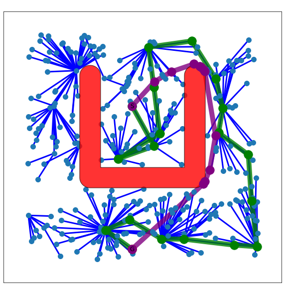
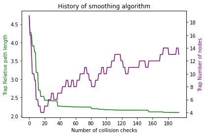
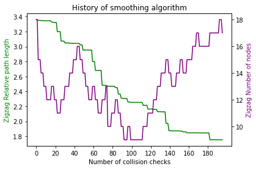
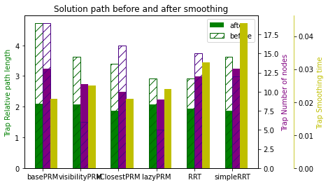
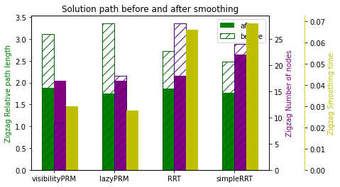
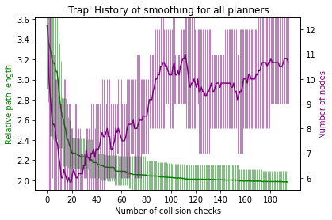
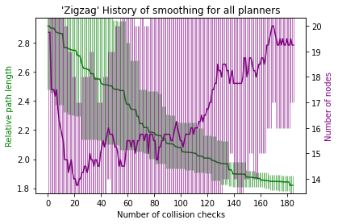
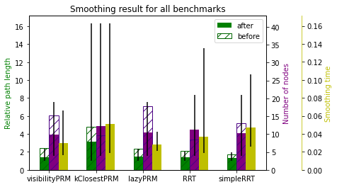

# Projektaufgabe 8: Glätten des Ergebnispfades nach Latombe

Neue Klasse `IPSmoothing` mit Algortihmus und Helferfunktionen

## How to run:

Anwendung im python notebook mit `resultList` der vorherigen Schritte:

```
from IPSmoothing import IPSmoothing
k = 3 # Parameter for smoothing
eps = 0.1 # Cancel threshold for DelTree
variance_steps = 10

IPSmoothing.statistics = []

for result in resultList:

    smoother = IPSmoothing(result)

    smoothed_graph = smoother.smooth_solution(k, eps, variance_steps)

    if smoothed_graph is not None:
        smoother.visualize_path(plannerFactory, smoothed_graph) 
        smoother.draw_history()

IPSmoothing.draw_statistics(IPTestSuite.benchList[0:25])

IPSmoothing.draw_history_per_benchmark(IPTestSuite.benchList[0:25], num_coll_checks = 100, combine_all = False)

IPSmoothing.draw_history_per_benchmark(IPTestSuite.benchList[0:25], num_coll_checks = 100, combine_all = True)

IPSmoothing.draw_statistics_all_combined()
```

## Visualization output

### Single benchmark and single algorithm







### Smoothing statistics per benchmark and algorithm




### Smoothing history per benchmark (mean and error of algorithms)




### Smoothing history for all benchmarks and algorithms


### Smoothing statistics per algorithm (mean and error of benchmarks)


