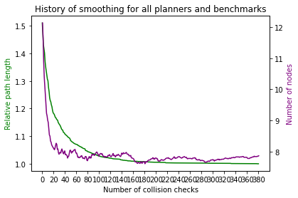
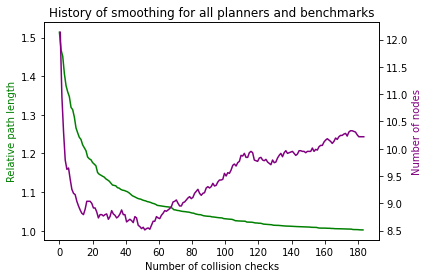

# Projektaufgabe 8: Glätten des Ergebnispfades nach Latombe

- Aufgabenstellung: siehe `Projektaufgabe_8.pdf`(nur in Email angehängt)
- Präsentation siehe: `Projektaufgabe_8_Glaetten-nach-Latombe.ppt` (nur in Email angehängt)
- Smoothing Algorithmus: siehe `IPSmoothing.py`
- Ergebnisdiskussion: hier im `README.md`
- Lösungen zu Aufgabe 2: hier im `README.md`

## How to run:

Starte die Datei `IP-X-0-Automated_PlanerTest.ipynb`

Der Smoothing Algorithmus wird dort importiert, ebenso die Planer. (Achtung: teilweise wurden Bugs in den Planern korrigiert, damit alle Benchmarks durchlaufen, es sollten also die Dateien im Projekt verwendet werden)

Der Smoothing Algorithmus arbeitet mit `resultList` der vorherigen Schritte.

```python
from IPSmoothing import IPSmoothing
k = 3 # Parameter for smoothing
eps = 0.5 # Cancel threshold for DelTree
variance_steps = 20 # Window for rolling variance
min_variance = 0.01 # Minimum variance as cancel threshold

IPSmoothing.statistics = []

for result in resultList:

    smoother = IPSmoothing(result, plannerFactory)

    smoothed_graph = smoother.smooth_solution(k, eps, variance_steps, min_variance)

    if smoothed_graph is not None:
        smoother.visualize_path(plannerFactory, smoothed_graph)
        smoother.draw_history()

# Plot graph and statistics for every solution
# IPSmoothing.draw_statistics(IPTestSuite.benchList) #[0:24]
# IPSmoothing.draw_history_per_benchmark(IPTestSuite.benchList, num_coll_checks = 200, combine_all = False)

IPSmoothing.draw_history_per_benchmark(IPTestSuite.benchList, num_coll_checks = 200, combine_all = True)
IPSmoothing.draw_statistics_all_combined()
```

## Ergebnisdiskussion

### Einfaches Benchmark nach Glättung


In diesem Benchmark sieht man den originalen Lösungspfad des BasicPRM Planers (grün) und den geglätteten Pfad nach dem Smoothing nach Latombe (lila).

Das Smoothing wurde über 200 Collision checks durchgeführt.

Im folgenden ist der Verlauf der relativen Pfadlänge (grün) und der Knotenanzahl (lila) während dem Glätten dargestellt.


Man sieht ein Miminum der Knotenanzahl bei ca. 50 Collision Checks.

Um Rechenzeit zu sparen (Collision checks im 6D Raum sind sehr aufwändig) wird versucht den optimalen Abbruchzeitpunkt zu finden.

Dies ist ein Kompromiss mit der Genauigkeit der Glättung bzw. eine längere Pfadlänge wird in Kauf genommen.

Die gleitende Varianz der letzten n Pfadlängen wird mit der definierten minimalen Varianzwert verglichen.

Im folgenden Graph ist das Varianzabbruchkriterium (n=20, var_min=0.01) so gewählt, dass das Knotenminimum erreicht wird.


Ein kürzerer Weg um ca. 10% im Vergleich zu 200 collision checks wäre möglich gewesen. 

Auch im Pfad sieht man, dass dies nicht der optimalste Weg ist.


## Vergleich der verschiedenen Planer

Um den Einfluss der verschiedenen Planer bzw. deren Lösungspfade auf das Smoothing zu ermitteln wurden hier alle Planer zusammen betrachtet und deren Mittelwert (durchgezogen) und min bzw. max (dünne Linien) aufgetragen.


Nach ca. 70 Collision checks ist es ziemlich egal welcher Planer verwendet wurde. Die geglätteten Pfade kommen auf eine sehr ähnliche Länge.

Dieser Punkt hängt stark vom jeweiligen Benchmark ab und verschiebt sich bei schwereren Szenen stark nach rechts.

Die Statistiken der verschiedenen Planer zeigen dies auch. 

Der orignale Pfad (gestrichelt) und das Ergebnis nach dem smoothing (ausgemalt) sind sowhol bei Pfadlänge (grün) Knotenanzahl und Berechnungszeit (gelb) nach dem Glätten auf einem sehr ähnlichen Wert.


## Ergebnisse auf allen Benchmarks

Das selbe Ergebnis zeigt sich beim Vergleich aller Benchmarks und Planer:


- Im Durchschnitt sind die Benchmarks schwerer als bei "Trap". 
- Es braucht im Mittel ca. 40 collision cheks um ein Plateua in der Knotenanzahl zu erreichen.
- Die Pfadlänge ist monoton fallend.
- Die Anzahl der Knoten hängt stark vom jeweiligen benchmark ab.
- Das optimale Varianzabbruchkriterium hängt stark vom jeweiligen Benchmark ab.


Die Statistiken zeigen bis auf einem Außreißer beim lazyPRM ist es egal welchen Planer man davor benutzt hat.

Alle Planer kommen zu einem ähnlich gutem Ergebnis.

- Reduzierung der Pfadlängen um 25 - 90 %
- Halbierung der Knotenanzahl bei VisibilityPRM, LazyPRM und Simpel RRT
- Nur kleine Reduzierung der Knotenanzahl (bei schon sehr guten Lösungen) von kClosest und RRT
- Berechnungszeit für 200 Collision Cheks fast immer unter 0.1 s

## Parameteranalyse

Mit dem Varianzabbruchkriterium kann beeinflusst werden, wann abgebrochen wird um Rechenzeit zu sparen aber einen längeren Pfad in Kauf zu nehmen.

Viel interessanter ist es an den Parametern der Glättung optimierung vorzunehmen und den Verlauf an sich zu beeinflussen.

Mögliche Parameter:

- k = 3 (der k-te Nachbar wird versucht zu verbinden)
- epsilon = 0.5 (Abbruchkriterium für deltree, minimaler Abstand)
- n = 200 (Anzahl kollision checks)

Hier ist der Verlauf bei den anfangs gewählten Parametern: 


Eine Verdopplung auf n=400 hat kaum Einfluss auf die Pfadlänge.



Reduzierung auf epsilon=0.1 zeigt wie zu erwarten einen Anstieg in der Knotenanzahl.

Epsilon gibt an ab welcher Distanz nicht mehr weiter probiert wird neuen Verbindungen aufzubauen.

Bei einem kleineren Epsilon macht es Sinn, dass mehr Verbindungen bzw. Knoten erstellt werden.

Die Pfadlänge verbessert sich dadurch allerdings nicht.



Durch Reduzierung des k Parameters auf k=1 erhöht sich die Steigung mit der die Pfadlänge abfällt enorm.

Hiermit kann deutlich schneller ein kürzerer Pfad gefunden werden.

K=1 Bedeutet im Enddeffekt, dass nur der Deltree algorithmus angewendet wird und sowfot versucht wird neue Knoten zu generieren.


Dies sind die optimalen Parameter:

- k = 1 
- epsilon = 0.5
- n = 200

## Lösungen zu Aufgabe 2
### Kann der Lösungspfad mit einem Industrieroboter abgefahren werden?
Ja, das abfahren ist prinzipiell möglich. Die Berechnung sollte bei eimem standardmäßigem 6-DOF Roboter jedoch auch im 6D Raum erfolgen. 
### Was bremst die Abfahrgeschwindigkeit noch aus?
Die gesamte Bewegung wird aus PTP Bewegungen bestehen. Jedoch hat der Pfad trotz der Glättung noch Punkte an denen der Roboter seine Bewegung stoppen wird.
### Wie könnte man weiterhin die Abfahrgeschwindigkeit erhöhen?
Dieser Bewegungsstop an den Punkten kann durch ein Überschleifen der Punkte verhindert werden. Dabei ist zu beachten, dass der beim Smoothing erstellte Pfad "wie ein Gummi" um das Hindernis gespannt ist. Das Überschleifen würde daher sehr wahrscheinlich zu Kollisionen führen. Ein Abstand kann zum Beispiel durch ein "Aufblähen" des Hindernisses zu Beginn der Pfadsuche und des Smoothings sichergestellt werden.
